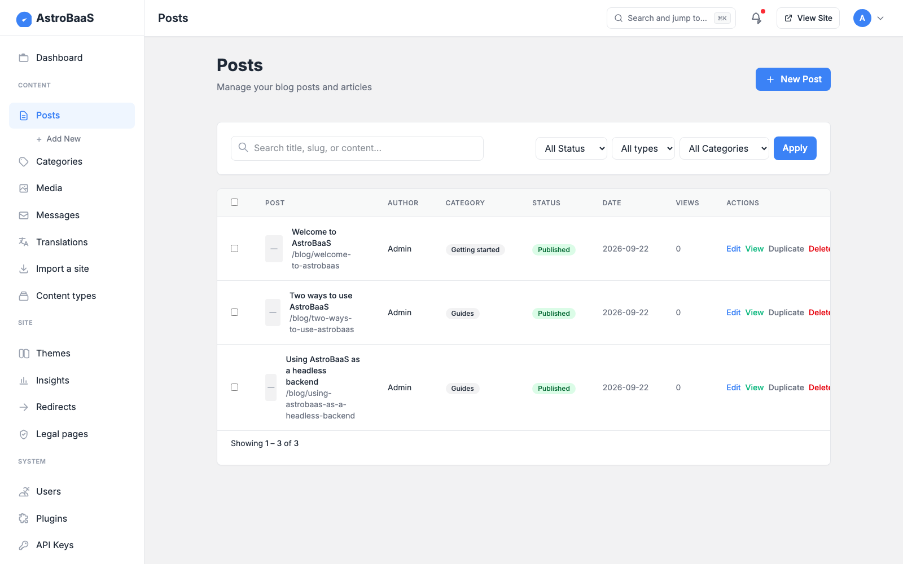
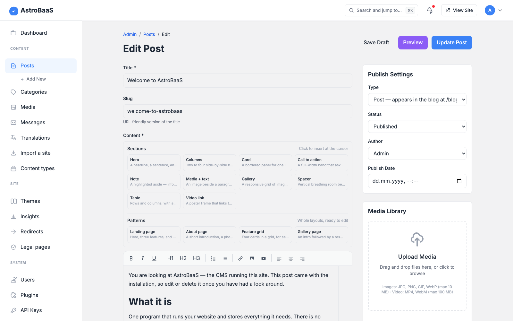

# AstroBaaS

[](https://github.com/operator888/astrobaas/actions/workflows/ci.yml)
[](./LICENSE)
[](./.nvmrc)

**A self-hostable, TypeScript-native backend — auth, data, REST API and file
storage — with a content admin built in.** One Node process, no PHP, no plugin
marketplace, no licence check anywhere in the code.

> **Extensible by developers at build time, not by operators at runtime.**
> Plugins and themes are typed TypeScript modules you import and deploy, not
> uploads you install from a dashboard. That is a deliberate trade: you get type
> safety, a strict CSP and no arbitrary-code-upload surface, and you give up
> click-to-install. See [Extensibility model](#extensibility-model).

One install, two ways to use it:

- **As a CMS.** The public site is server-rendered HTML with almost no client
  JavaScript; the admin at `/admin` is ordinary HTML forms. There is no build
  step between writing a post and serving it — publishing is a write, not a
  deploy.
- **As a headless backend.** Point any frontend at the REST API with a bearer
  API key and configurable CORS. There is a typed SDK, a CLI, an MCP server so
  AI agents can drive it, signed webhooks, and a machine-readable contract at
  `/llms.txt` and `/openapi.json`.

> **Status: pre-alpha.** The feature list below is what works today and
> [What's not done yet](#whats-not-done-yet) is the honest other half. Read
> [SECURITY.md](./SECURITY.md) before putting it on the internet.
>
> **To run the CMS, clone the repository** — that is the supported install. The
> npm package, `npm install astrobaas@alpha`, is for using `astrobaas/client`,
> `astrobaas/core` and `astrobaas/plugins` from your own project, and for the
> CLI; it does not give you a running site. The MCP server is its own
> zero-dependency package, `npx -y astrobaas-mcp`.
> [PUBLISHING.md](./PUBLISHING.md) explains the `alpha` tag.



## Why AstroBaaS

| You want… | AstroBaaS gives you |
| --- | --- |
| A site you can self-host on a small VPS | One Node process. `db.json` plus an uploads directory are the entire data layer. |
| Static-site speed without rebuilding to publish | Astro SSR — the database is read through an in-process cache, so a post is live the moment it is saved. |
| Content you can get back out | Importers for WordPress WXR and plain markdown; the whole site backs up as one JSON file. |
| A backend an AI agent can drive | `/llms.txt`, a drift-tested `/openapi.json`, a typed client and a 33-tool MCP server. |
| Software that doesn't oversell itself | The changelog and the gaps list say exactly what works and what doesn't. |

It is **not** a WordPress replacement at scale, and it is not multi-tenant: one
install serves one site.

## Quick start

Requires **Node 22.12+** (see `.nvmrc`).

```bash
git clone https://github.com/operator888/astrobaas.git
cd astrobaas
cp .env.example .env       # optional in dev; AUTH_SECRET is required in production
npm install
npm run dev                # http://localhost:4321
```

Sign in at `http://localhost:4321/login` with `admin@local` / `admin`, and
change that password immediately — the dashboard says so until you do, and in
production the published default is refused outright.

### Deploying

- **Docker, Coolify, or anything that builds a Dockerfile:** point it at the
  repository and use the bundled `Dockerfile`.
- **A Linux server you own** (nginx or Caddy, systemd, zero-downtime releases):
  [`deploy/README.md`](./deploy/README.md) walks the whole setup and `deploy.sh`
  ships a release.

Set `AUTH_SECRET` (`openssl rand -hex 32`) and mount a volume at `/app/data` so
the database and uploads survive a redeploy. A production build refuses a
missing, short, or `.env.example` placeholder secret.

To run a production build by hand, note that `npm start` does not read `.env`:

```bash
npm run build
node --env-file=.env ./dist/server/entry.mjs   # plain http://localhost: add COOKIE_SECURE=0 to .env
```

`npm run` lists everything else: the production build and start, the importers,
`npm run setup` to create an admin, and the test suites.

| The editor | Signing in |
| --- | --- |
|  |  |

## What you get

**Security.** Signed-cookie sessions, PBKDF2 password hashing, double-submit
CSRF, per-IP rate limiting (in-process, or shared across replicas on libSQL),
and a hash-based CSP with no `'unsafe-inline'`. Optional TOTP two-factor with
backup codes. Every public endpoint returns an explicit allow-list rather than
whatever it happens to hold.

**Content.** Posts, standalone pages, categories, users and media, with a
draft → review → scheduled → published → trashed workflow, revisions, autosave,
custom taxonomies and moderated comments. Stored HTML is sanitised against an
allow-list on save. Headings get stable anchors, body images carry their own
dimensions, and an optional table of contents renders above long articles. What
`content_rendered` returns is byte for byte what the CMS renders itself — all
four renderers call one function.

**Custom content types.** Register a type and get CRUD at
`/api/content/<type>` with the same auth, validation and admin screens as the
built-in types.

**Search you can teach.** Ranked, accent- and case-folding, weighted by field,
with a synonym table you maintain — entering `sofa, couch, settee` makes all
three find each other.

**Editor sections and patterns.** A palette of pre-designed blocks (hero,
columns, card, CTA, note, media, gallery, table, video) and whole-page patterns,
inserted as allow-listed CSS classes rather than a parallel block tree — so
`content` stays the HTML string every downstream consumer already reads, and
themes restyle sections through design tokens.

**Media a decoupled frontend can use.** Every upload records its dimensions and
generates a fixed set of WebP derivatives (400/800/1600, never upscaled), so a
storefront builds a `srcset` instead of running its own image pipeline. The API
publishes absolute URLs so a frontend on another host resolves images against
the CMS.

**Commerce, in the core and off by default.** Products, brands, categories,
orders and customers, with server-side pricing in integer cents and atomic stock
reservation, so concurrent checkouts cannot oversell the last unit. A fresh
install is not a shop: the master switch starts off and the admin has no Shop
section until you turn it on. See [COMMERCE.md](./COMMERCE.md).

**Payments.** Stripe, PayPal and Klarna, plus bank transfer and cash on
delivery — hosted checkout only, so card data never touches your server and a
self-hosted install stays outside PCI scope. The buyer gets a receipt at a
signed URL, as a page and as a downloadable PDF. Webhooks are signature- or
fetch-back-verified with no bypass, and a verified event still has to match the
order's amount before it can mark anything paid. See
[PAYMENTS.md](./PAYMENTS.md).

**Email.** Your own SMTP server, a webhook to any provider, or the bundled
SMTP2GO connector, with retries for transient failures only — never after the
message has gone. See [Email](#email) and [docs/EMAIL.md](./docs/EMAIL.md).

**Themes.** Switch theme and customise colours, typography and CSS in the admin
(served from `/theme.css`, so it applies on first paint under the strict CSP). A
theme can also replace templates — `Header`, `Footer`, `Home`, `PostCard`,
`PostArticle`, `PageArticle`, `Sidebar`, `Breadcrumbs`, `TableOfContents` — and
inherits the default for every slot it doesn't override, so adding a slot never
breaks an existing theme. See [THEME_DEVELOPMENT.md](./THEME_DEVELOPMENT.md).

**Plugins.** 23 filter and action hooks across content, commerce, search,
crawler policy and payments, with persisted activation, error isolation, a
namespaced store and a typed API from `astrobaas/core`. See
[PLUGIN_DEVELOPMENT.md](./PLUGIN_DEVELOPMENT.md).

**Internationalisation.** Set `SITE_LOCALES=en,de,fr` and posts carry a locale,
the admin gains a language picker, `/de/blog` serves German from the same
templates, and the API takes `?locale=`. Every link carries the locale and a
crawlable language switcher appears in the header. Unset means single-language,
with identical URLs to before.

**Storage you can change later.** lowdb JSON for zero-config local dev, or
SQLite/libSQL (Turso) for durable multi-host deploys — one `Storage` interface,
selected by `DATABASE_URL`, with the whole HTTP suite run against all three
drivers in CI. See [STORAGE.md](./STORAGE.md).

**Operations.** `/healthz` for orchestrators and `/api/health/deep`, which
*exercises* rather than introspects — it encodes an image, writes a probe file,
counts on the real rate-limit store and writes to the database, and answers 503
when anything essential is broken, so a deploy script can assert it with
`curl -fsS`. Optional Prometheus metrics and structured request logs.

**Roles.** admin, editor, author, manager (shop staff) and viewer, with the
admin navigation filtered by role so nobody sees a menu item that bounces them
back.

## Extensibility model

**Two tiers. Data installs at runtime; code is compiled in.** The dividing line
is not plugins versus themes — both come in both tiers. It is whether an
extension needs to *run* or merely to *describe*.

| | Declarative (manifest) | Compiled-in (code) |
| --- | --- | --- |
| **Install** | Paste JSON in the admin, or POST it to the install endpoint. No rebuild. | Add a folder and one import, redeploy. |
| **A plugin can** | Register content types, contribute `<meta>`/`<link>` tags, subscribe webhooks, add editor sections with scoped CSS. | Anything: hooks, filters, server logic, its own API routes and admin screens. |
| **A theme can** | Ship design tokens, a stylesheet and section patterns. | All of that, plus replace page templates. |
| **Runs code?** | Never. | Yes — it is your code. |

Astro compiles the server at build time, so anything that must execute on the
server has to be present at build time. That is a property of the runtime, not a
policy choice. What *is* a choice is that everything expressible as data was
made installable without a rebuild.

What the split buys:

- **No arbitrary-code-upload surface** — the single most-exploited vector in
  classic CMS ecosystems. A manifest cannot execute anything; compiled-in code
  is code you reviewed.
- **Type safety end to end** for the compiled tier: a bad hook signature fails
  the build, not production.
- **A strict CSP stays possible**, because executable extensions are known at
  build time. Plugin and theme CSS are served from routes for the same reason.
- **Manifests are validated, not trusted.** A plugin's CSS must be scoped to its
  own namespace, a theme's tokens must be values the vocabulary defines, and
  markup the sanitiser would rewrite is refused at install with the difference
  shown.

What you still give up: a plugin that needs server logic, or a theme that needs
to change page structure, is a code extension and needs a deploy.

## Paid modules

Everything in this repository is GPL and stays that way. What is sold separately
sits one level up, at the **vertical** — a theme and the plugins that go with
it, built for one trade and the way that trade actually works:

- **Optical and eyewear stores** — prescription capture and validation, dioptre
  and PD handling, lens configuration.
- **Hotels and short stays** — rooms and rates, availability, bookings.
- **Restaurants** — menus, opening hours, table and pickup ordering.
- More trades will follow, one at a time.

Nothing of the sort is on sale yet, and none of it is in this repository — the
core carries only the plugin seams such a module would load through.

Three rules hold, and they are constraints on the project rather than promises
of good behaviour:

- **The core behaves identically without them.** A feature that only makes sense
  in a paid module never removes something from the core to create the gap.
- **No licence check on the request path.** A site's uptime must never depend on
  a licence server being reachable.
- **Nothing here refuses to run.** There is no licence check anywhere in this
  codebase.

**Commerce is not one of these.** It is core and stays core — 42 of the 131
methods on the `Storage` interface are commerce, and splitting it would buy an
abstraction nobody needs. The full reasoning is in
[LICENSING.md](./LICENSING.md).

## Use it as a backend

> Full walkthrough: **[INTEGRATION.md](./INTEGRATION.md)** — keys, CORS, SDK,
> webhooks, MCP, CLI.

Mint an API key in the admin (or `POST /api/keys`), then from any origin:

```ts
import { createClient } from 'astrobaas/client';

const baas = createClient('https://cms.example.com', { apiKey: process.env.ASTROBAAS_KEY });

const posts = await baas.posts.list({ status: 'published', limit: 10 });
const post  = await baas.posts.get('hello-world');
await baas.posts.create({ title: 'From my frontend', status: 'draft' });
await baas.content('product').create({ name: 'Widget', price: 9 });
```

- **Bearer auth and CORS.** Send `Authorization: Bearer <key>`; bearer requests
  are CSRF-exempt. Start the server with `CORS_ORIGINS` listing your frontend's
  origin. **Scope your keys** — a scoped key is deny-by-default and may only
  touch the resources it names.
- **AI agents.** Run the MCP server and an agent operates the backend as tools:

  ```jsonc
  { "mcpServers": { "astrobaas": {
      "command": "npx", "args": ["-y", "astrobaas-mcp"],
      "env": { "ASTROBAAS_URL": "https://cms.example.com", "ASTROBAAS_KEY": "abk_..." } } } }
  ```

  The MCP server is a separate zero-dependency package, so the agent's machine
  needs no AstroBaaS install. Agents can also just read
  `/llms.txt` or `/openapi.json`.
- **Webhooks.** `POST /api/webhooks { url, events }` to be notified on `post.*`
  and `content.*` events. Every delivery is signed:
  `X-AstroBaaS-Signature: sha256=HMAC-SHA256(secret, rawBody)`.

### Scaffolding extensions

```bash
npx astrobaas plugin new my-plugin        # code plugin  -> src/plugins/my-plugin/
npx astrobaas theme new my-theme          # theme        -> src/themes/my-theme/
npx astrobaas plugin manifest my-thing    # declarative manifest (installs at runtime)
npx astrobaas plugin validate my-thing.manifest.json
```

`validate` runs the *same* validator as the install endpoint, so "valid here"
means "installable there".

## What's not done yet

- **Runtime installation is data-only.** A manifest carries settings, content
  types, webhooks, design tokens, stylesheets, sections and patterns — not code.
  Anything that runs JavaScript on the server, or replaces a page template, is a
  compiled-in extension and needs a rebuild.
- **Editorial depth is thinner than WordPress.** Revisions, autosave, custom
  taxonomies and moderated comments have landed, but there is a long tail behind
  them.
- **A pasted `<iframe>` is discarded.** It is not on the sanitiser's allow-list
  and never will be — that is a large part of what keeps the strict CSP intact.
  Embeds work the other way round: the editor stores a provider-and-id
  placeholder and the page renders a consent-gated facade that makes no
  third-party request until the reader clicks. YouTube, Vimeo and OpenStreetMap
  work that way; the networks that require their own JavaScript are refused,
  with a reason.
- **No PDF of an ARTICLE, no ESP adapter, no custom role names.** A receipt is
  generated as a real PDF file (`/receipt.pdf?token=…`), drawn directly with an
  embedded Unicode font — no headless browser. An article is not: laying out
  flowing text, headings and images on paper is what a browser does well, and
  the print view plus Save-as-PDF covers it. Subscriber events are emitted as
  webhooks so you can sync a provider yourself, but no adapter is bundled. Four of the five roles are editable capability by capability; adding
  a *new* role name is not supported, because a name the routes have never heard
  answers "no" everywhere.
- **Payment providers are not sandbox-verified.** The protocol logic and every
  security control are implemented and adversarially tested, and the full
  webhook → capture chain runs in the smoke suite; what has not been done is a
  round trip against the providers' live sandboxes. Run yours there before
  taking real money.
- **No independent security audit.** The code has been through an adversarial
  self-review with regression tests ([SECURITY.md](./SECURITY.md)), but no
  external pentest, fuzzing or bug bounty.
- **Multi-host needs libSQL.** The lowdb default does not survive replicas. For
  real multi-writer traffic use the relational driver
  (`DATABASE_DRIVER=relational`); the default doc-blob mode is last-write-wins.
  Rate limiting shares counters across replicas only with
  `RATE_LIMIT_STORE=libsql`.

## Configuration

### Required

| Variable | Purpose | Default |
| --- | --- | --- |
| `AUTH_SECRET` | HMAC key for session cookies. **≥ 16 chars.** | A dev-only insecure value (warns) |
| `NODE_ENV` | When `production`, a missing `AUTH_SECRET` is fatal. | unset |

### Optional

| Variable | Purpose |
| --- | --- |
| `DATABASE_URL` | Selects the storage engine: unset → lowdb JSON; `file:…` → local SQLite; `libsql://…` → Turso/remote. |
| `DATABASE_AUTH_TOKEN` | Auth token for a remote `libsql://` database. |
| `CORS_ORIGINS` | Space- or comma-separated origins allowed to call `/api/*` cross-origin. Credentials are never allowed. |
| `RATE_LIMIT_PER_MIN` | Default `60`. Raise it if you are behind a CDN. |
| `RATE_LIMIT_STORE` | `libsql` shares rate-limit counters across replicas; default is in-process. |
| `TRUST_PROXY` | `1` to honour `X-Forwarded-For` — only behind a proxy you control. |
| `COOKIE_SECURE` | Force the cookie `Secure` flag (`1`/`0`); on by default in production. |
| `CSP_*` | Per-directive CSP allow-lists for CDN and 3D assets (see `.env.example`). |
| `METRICS_ENABLED` | `1` exposes Prometheus counters at `/metrics` (off by default). |
| `LOG_REQUESTS` | `1` emits one structured JSON log line per request. |
| `HEALTH_TOKEN` | 32+ random characters. Lets a deploy script read `GET /api/health/deep` without a session. Unset means admin session only, and everyone else gets a 404. |
| `MEDIA_ORIGINAL_EXIF` | `keep` retains the uploaded file byte for byte. By default the EXIF block is stripped losslessly — it carries GPS and a device serial, and the original is fetchable at a guessable URL. |
| `MEDIA_KEEP_ORIGINALS` | `0` discards the uploaded file once its derivatives exist. On by default. |
| `SANITIZE_STRICT_CLASSES` | `1` makes stored classes a closed set, dropping the plugin-section namespace. Off by default: turning it on strips plugin sections out of content on save. |

Every variable is documented in `.env.example`.

### Email

Out of the box nothing is sent: `EMAIL_TRANSPORT` defaults to `console`, which
prints each message to the server log. To send for real, point it at a mail
server you have an account on:

```ini
EMAIL_TRANSPORT=smtp
SMTP_HOST=mail.example.com
SMTP_PORT=587                      # 587 = STARTTLS; or 465 with SMTP_SECURE=1
SMTP_USER=noreply@example.com
SMTP_PASS='the-password'           # always single-quoted; set on the server, never committed
EMAIL_FROM="Example <noreply@example.com>"
EMAIL_REPLY_TO=info@example.com    # where replies go, if EMAIL_FROM is unmonitored
```

Then prove it works before you need it — `npm run mail:test you@example.com`
sends one message through the app's own mail code and exits non-zero if the
server refuses it.

**[docs/EMAIL.md](./docs/EMAIL.md) is the operator's reference:** every option,
what is retried and what is deliberately never retried, why a send can end as
*outcome unknown* rather than sent or failed, what each refusal from a mail
server means, and how to run the test against exactly what the service sees.

### Where data lives

- **Database:** `db.json` by default (gitignored, seeded on first boot, delete
  to reset, override with `DB_PATH`). Set `DATABASE_URL` for SQLite/libSQL.
- **Uploads:** `public/uploads/<yyyy>/<mm>/<hash>.<ext>`, gitignored; override
  with `UPLOADS_DIR`.

### Schema migrations

The database records a schema version, and pending migrations run automatically
at startup across whichever driver is active — so upgrading in place is
deploying the new build and restarting. `GET /readyz` reports the current and
expected version and returns 503 if the database is stuck below what the build
needs, so an orchestrator holds traffic until the upgrade completes. Migrations
live in [`src/lib/migrations.ts`](./src/lib/migrations.ts); see
[UPGRADE.md](./UPGRADE.md).

## Architecture

```
Browser / frontend / AI agent
   │  cookie + CSRF (admin)  ·  bearer API key (headless)  ·  MCP (agent)
   ▼
Astro SSR (Node adapter)
   ├── middleware.ts        auth, CSRF, CORS, rate limits, security headers
   ├── src/pages/api/*      REST endpoints, one envelope shape
   ├── /llms.txt /openapi.json    machine-readable contract
   └── src/pages/*.astro    admin + public UI
            │                     └─► signed webhooks to subscribers
            ▼
   LocalDB ──► Storage driver:  lowdb (db.json)  |  libSQL/SQLite (DATABASE_URL)
```

Theme, plugin and SDK authors import from `astrobaas/core` and
`astrobaas/client`, never from `src/lib/*` — see
[architecture.md](./architecture.md) for how it fits together and
[STABILITY.md](./STABILITY.md) for what is promised.

## Documentation

| | |
| --- | --- |
| [INTEGRATION.md](./INTEGRATION.md) | Drive it from another app: keys, CORS, SDK, webhooks, MCP |
| [PLATFORM.md](./PLATFORM.md) | The extension seams, end to end |
| [PLUGIN_DEVELOPMENT.md](./PLUGIN_DEVELOPMENT.md) · [THEME_DEVELOPMENT.md](./THEME_DEVELOPMENT.md) | Write an extension |
| [COMMERCE.md](./COMMERCE.md) · [PAYMENTS.md](./PAYMENTS.md) | Run a shop |
| [STORAGE.md](./STORAGE.md) · [deploy/README.md](./deploy/README.md) · [MAINTENANCE.md](./MAINTENANCE.md) · [docs/EMAIL.md](./docs/EMAIL.md) · [docs/STAGING.md](./docs/STAGING.md) | Operate it |
| [FRONTEND_EFFECTS.md](./FRONTEND_EFFECTS.md) | Parallax, scroll effects and WebGL islands in the front end |
| [SECURITY.md](./SECURITY.md) · [STABILITY.md](./STABILITY.md) · [UPGRADE.md](./UPGRADE.md) | Before and after an upgrade |
| [CHANGELOG.md](./CHANGELOG.md) | What changed, and why |

## Security

This is pre-alpha software. Read [SECURITY.md](./SECURITY.md) before exposing it
to the internet. In short:

- Change the seed admin password.
- Generate a strong `AUTH_SECRET` (`openssl rand -hex 32`).
- Put it behind HTTPS. In production the session and CSRF cookies are `Secure`,
  so HTTPS is required.
- Persist and back up your data directory.

Report a vulnerability through [SECURITY.md](./SECURITY.md), not the issue
tracker.

## Licence

GPL-3.0-or-later — see [LICENSE](./LICENSE). You may run it anywhere, for
anything, commercially included; read it, change it, and redistribute it under
the same terms. [LICENSING.md](./LICENSING.md) explains how that sits alongside
the paid vertical modules, and
[THIRD-PARTY-NOTICES.md](./THIRD-PARTY-NOTICES.md) lists what the dependencies
require — `npm run audit:licenses` checks the production tree on every pull
request.

## Contributing

See [CONTRIBUTING.md](./CONTRIBUTING.md). Pull requests are gated on a
**[Contributor License Agreement](./CLA.md)** — a bot asks once, you reply with
one sentence, and later pull requests are not gated again. **You keep your
copyright**; the grant lets the maintainer license your work commercially as
well as under the GPL, which is what funds the work, and §4.1 commits to keeping
every merged contribution in the open-source edition. If you would rather not
sign, open an issue describing the change instead — it will be implemented
independently, with credit.
